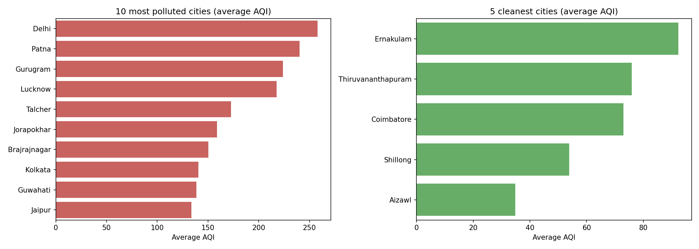
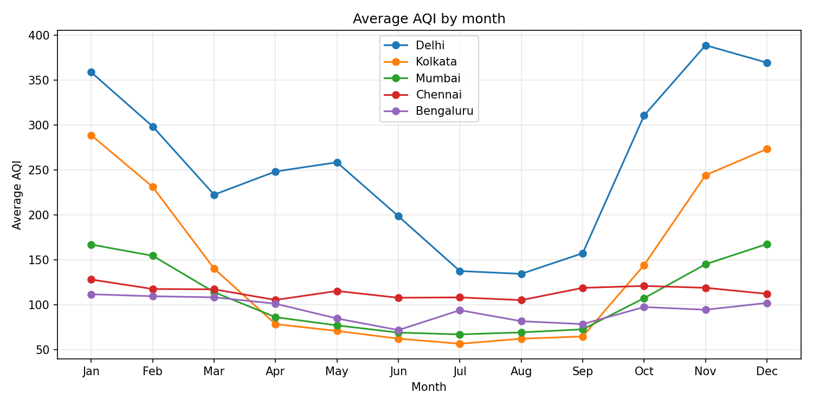
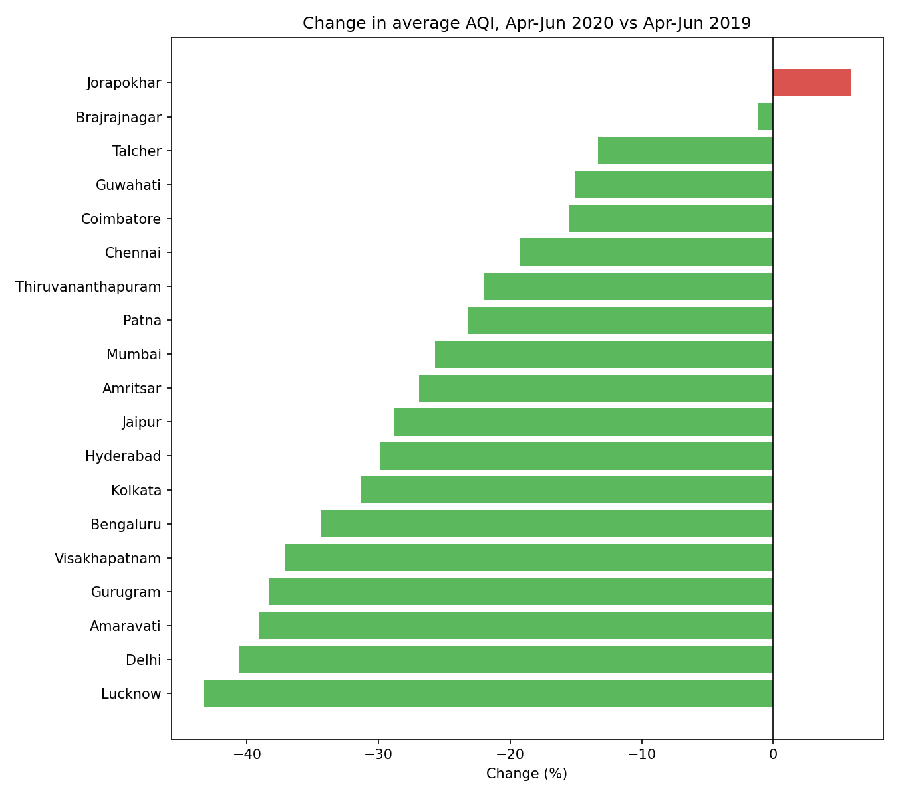
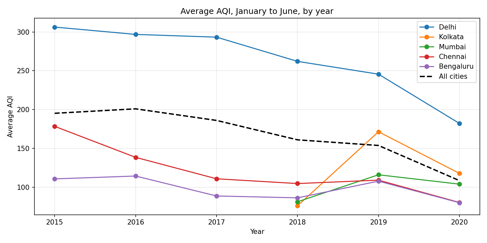
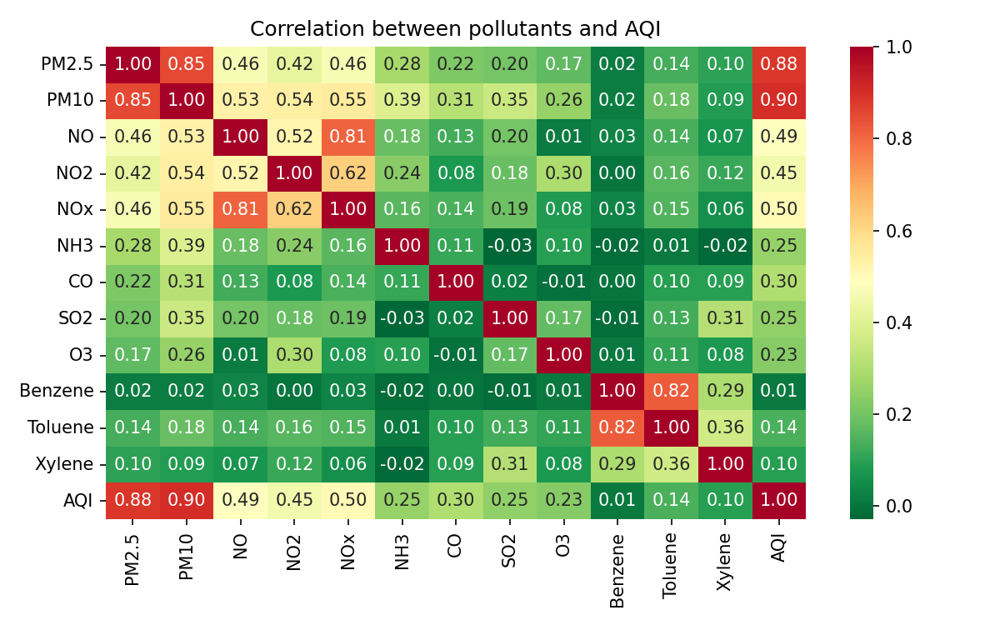
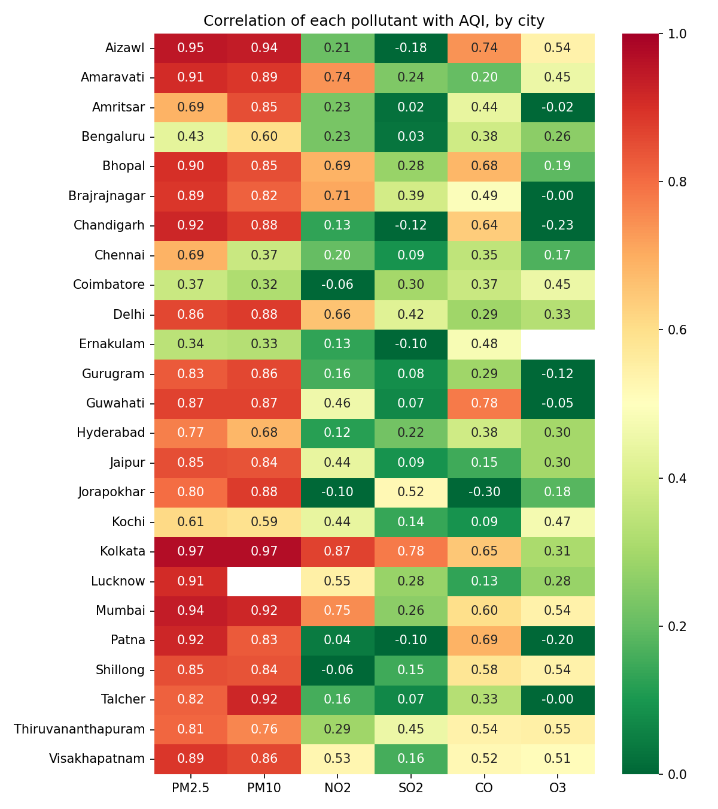
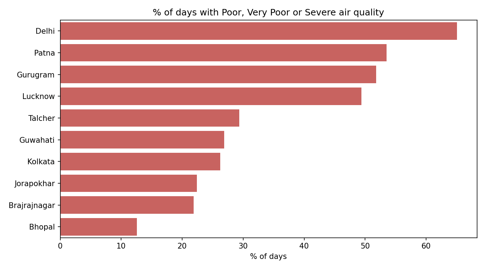

# Air Quality in Indian Cities (2015 - mid 2020)

An exploratory data analysis of daily air quality across 26 Indian cities, using Python (pandas, matplotlib, seaborn).

## Interactive dashboard

[View the Tableau Public dashboard](https://public.tableau.com/app/profile/sakhi.bhagat/viz/IndiaAirQualityDashboard2015-2020/Dashboard1). Click a city in the bar chart to see its month-by-month AQI pattern.

## Questions answered

1. Which cities are the most and least polluted?
2. How does AQI change through the year?
3. What happened to air quality during the 2020 COVID lockdown?
4. Is air quality improving over the years?
5. Which pollutants drive AQI, and does it differ by city?
6. How often do cities have Poor, Very Poor or Severe air?

## Data

- **Source:** [Air Quality Data in India (2015 - 2020)](https://www.kaggle.com/datasets/rohanrao/air-quality-data-in-india) on Kaggle, file `city_day.csv`.
- **Coverage:** 26 cities, 1 Jan 2015 to 1 Jul 2020, 29,531 daily rows.
- **AQI scale (India):** 0-50 Good, 51-100 Satisfactory, 101-200 Moderate, 201-300 Poor, 301-400 Very Poor, 401-500 Severe.

## Data cleaning

- Converted `Date` to a datetime type and added Year, Month and Season columns.
- Dropped 4,681 rows with no AQI value (about 16% of the data).
- Several pollutant columns have many gaps (Xylene about 61% missing, PM10 about 38%), so pollutant analysis uses only the days where readings exist.

### Data quality issues found

- **Ahmedabad was excluded from AQI comparisons.** Its CO readings had a median of about 16, roughly 8 to 11 times higher than other cities (about 1.4 to 1.9). This likely inflated its AQI far beyond the 500 scale maximum (412 of the 543 days above 500 came from Ahmedabad). The cause is probably a unit or sensor error, though I could not confirm this from the data alone.
- **Remaining AQI values above 500 were capped at 500**, the maximum of the Indian scale.
- **Cities have uneven amounts of data.** For example, Kolkata and Mumbai have no January to June readings before 2018, so their trend lines are less reliable.
- **A different dataset was rejected.** An apparent "2015-2024" dataset was tested and found to be synthetic: all cities and seasons averaged about 250 AQI, labels did not match values, and there were no missing values. Checking group averages caught this early.

## Key findings

- **Delhi is the most polluted city** (average AQI about 258), followed by Patna, Gurugram and Lucknow. About 65% of Delhi's recorded days were rated Poor or worse.
- **Air quality is strongly seasonal in North and East India.** Delhi peaks around November (average AQI about 390) and falls to about 135 in July and August. Chennai and Bengaluru stay fairly flat all year.
- **Seasons ranked by average AQI:** Winter (about 221), Post-monsoon (about 216), Summer (about 148), Monsoon (about 116).
- **During the 2020 lockdown (Apr-Jun), AQI was lower in nearly every city** compared with the same months of 2019, by about 15% to 43%. The biggest falls were in Lucknow and Delhi. This is consistent with reduced traffic and industry, though weather also varies year to year.
- **Delhi's Jan-Jun AQI was already falling from 2015 to 2019**, then dropped about a further 26% in 2020.
- **PM10 and PM2.5 dominate AQI** in most cities (correlation about 0.9 overall). Some cities also show strong links to gases, such as NO2 in Kolkata and Mumbai and CO in Guwahati and Patna.
- **Industrial and coal-mining towns** (Talcher, Jorapokhar, Brajrajnagar) rank surprisingly high for their size.

## Charts

## Limitations

- The data ends in July 2020, so it does not show recent years.
- Correlation between a pollutant and AQI is partly built in, since AQI is calculated from pollutant readings. It does not prove what causes pollution in a city.
- The lockdown comparison uses two years only and does not control for weather.
- The all-cities average in the yearly trend is affected by cities joining the data over time, so individual city lines are more trustworthy.

## Tools

Python, pandas, matplotlib, seaborn, Jupyter (VS Code).

## Possible next steps

- Extend the analysis with newer official CPCB data.
- Build an interactive dashboard in Power BI or Tableau Public.
- Focus on a single city in more depth.